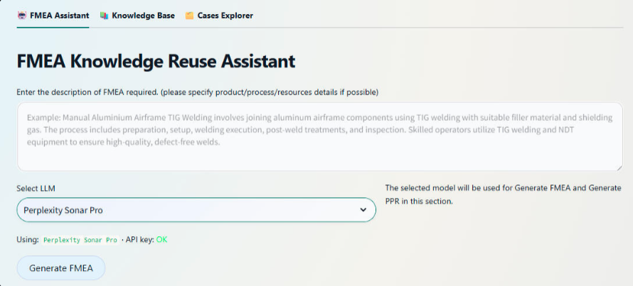
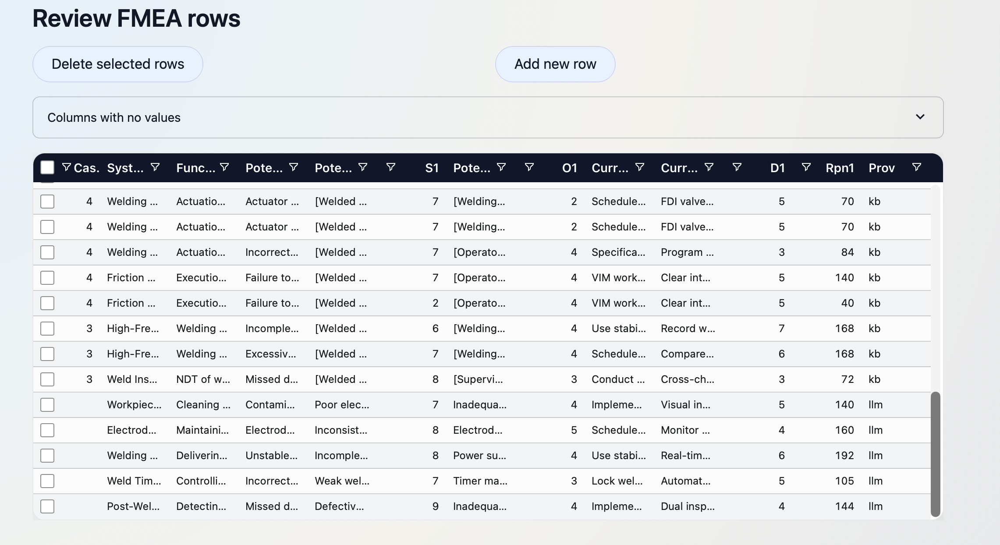

# FMEA Knowledge Reuse Assistant (CBR + RAG for Reliability Engineering)

A Streamlit web app (Master’s thesis, OvGU) that helps engineers **reuse and extend historical welding FMEAs** using Case‑Based Reasoning (CBR) and Retrieval‑Augmented Generation (RAG), backed by a Supabase (PostgreSQL + pgvector) semantic knowledge base.  
It also includes an evaluation setup to compare multiple LLM providers on **accuracy, usability, and cost-to-output** for engineering-grade FMEA drafting.

**Live app:** https://fmea-cbr.streamlit.app/  
**Portfolio write-up:** [FMEA Knowledge Reuse Assistant](https://ranjith-mahesh-en.carrd.co/#fmea)  
**University/Thesis:** Otto von Guericke University (OvGU) — Master’s Thesis

## Why this project
FMEA is powerful but repetitive: teams often recreate similar risk analyses for new product variants or process changes, even when past FMEAs contain reusable knowledge.

This project focuses on:
- Converting historical FMEAs into a **living case base** that engineers can search and adapt.
- Grounding LLM suggestions in retrieved real cases (RAG) to reduce irrelevant or unsafe outputs.
- Keeping experts in control via Human‑in‑the‑Loop review and approval.

## What it does (3 pages)
### 1) FMEA Assistant
- Enter a welding step / process element description in natural language.
- Retrieve semantically similar historical cases from the case base (vector search).
- Use retrieved cases as context for an LLM to draft FMEA rows (failure modes, causes, effects, actions) and optional PPR (Products, Process, and Resources details).
- Review/edit everything in an interactive table before saving as a new/updated case.

### 2) Knowledge Base (APIS IQ import)
- Upload FMEAs Excel files generated using APIS IQ tool.
- Store raw files in Supabase Storage and parse them into a structured FMEA schema.
- Create embeddings for rows/cases to enable meaning-based retrieval (semantic search).

### 3) Cases Explorer
- Browse, filter, and inspect stored cases and FMEA rows.
- Maintain the case base and capture expert-validated updates (closing the CBR loop).

## Quick start (use the hosted app)
1. Open the app: https://fmea-cbr.streamlit.app/
2. Choose a page based on your task (FMEA Assistant / Knowledge Base / Cases Explorer).
3. Generate suggestions, edit/approve them, and save back into the knowledge base.
4. Reuse saved cases as context for future FMEAs.

## Example prompt
> Create process level FMEA rows for an Automated resistance spot welding process on automotive body parts. Focus on a maximum of 5 critical failure modes, including causes, effects, and recommended actions.

Output

## How it works (CBR + RAG + Human-in-the-Loop)
- **Retrieve (RAG):** Create embeddings for stored cases and the user query; retrieve nearest neighbors via pgvector similarity search (cosine distance / inner product).  
  Reference: Supabase describes semantic search with embeddings and similarity metrics (including cosine). https://supabase.com/docs/guides/ai/semantic-search
- **Generate:** Provide retrieved cases as grounded context to the LLM to draft FMEA rows and PPR suggestions.
- **Verify (HIL):** A human-in-the-loop UI ensures engineers review, edit, and approve content before persistence.
- **Iterate (CRISP‑DM):** Business understanding → data understanding → preparation → modeling → evaluation → deployment.  
  Reference CRISP-DM phases: https://start.agilytic.com/crisp-dm

## Multi‑LLM evaluation (what I validated)
This project includes experiments to compare LLM providers for engineering knowledge work, such as:
- Accuracy and relevance of generated FMEA rows (grounded vs non-grounded)
- Usability (edit distance / time-to-acceptable output)
- Cost-to-output trade-offs across providers
- Consistency across runs and sensitivity to prompt constraints

LLM providers evaluated (as implemented in this project):
- Claude 3.5
- OpenAI GPT‑4
- Perplexity Sonar Pro
- Google Gemini Flash 2.5
- Mistral Large

## Output
- Draft FMEA rows (failure mode, cause, effect, recommended action) suitable for expert review.
- Optional PER (Process Element Requirements) aligned with a Product‑Process‑Resource (PPR) ontology.
- A growing, semantically searchable case base that improves as validated cases are added.

## Tech stack (AI Software Engineer oriented)
- Python (ETL/parsing, retrieval + generation orchestration, evaluation scripts)
- Streamlit (multi-page app; interactive tables for human-in-the-loop editing)
- RAG + CBR patterns (retrieve similar cases → generate grounded drafts → store validated improvements)
- Embeddings: Sentence-Transformers (semantic text embeddings)  
  Reference (STS usage/docs): https://sbert.net/docs/sentence_transformer/usage/semantic_textual_similarity.html
- Similarity search: cosine similarity/cosine distance; nearest-neighbor retrieval in Postgres via pgvector (Supabase) [Supabase docs reference above]
- Supabase backend:
  - PostgreSQL (FMEA schema: cases, rows, PER entities)
  - pgvector (embedding storage + similarity operators)  
  - Supabase Storage (raw APIS IQ Excel uploads)

## Notes / limitations
- Outputs must be reviewed by qualified engineers (safety-critical domain).
- Retrieval quality depends on the coverage and cleanliness of the imported case base.
- LLMs can still make mistakes; grounding + constraints reduce risk, but do not eliminate it.
